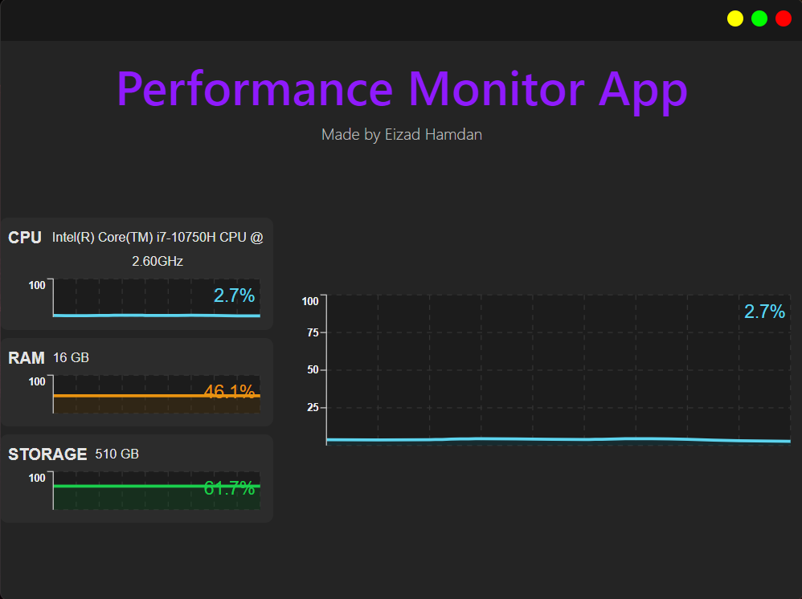
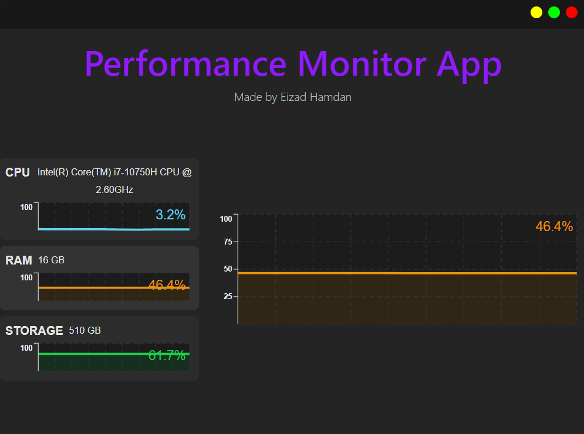
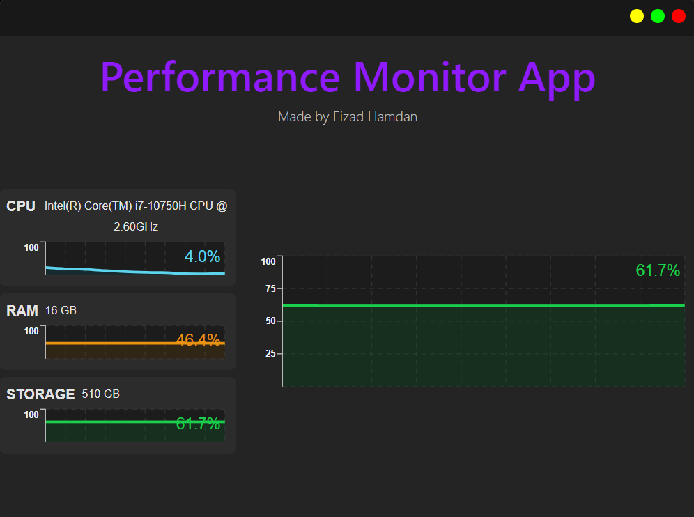

# Performance Monitor App

Welcome to the **Performance Monitor App** repository! This lightweight and intuitive cross-platform desktop application is designed to help you monitor your computer's performance in real-time, giving you valuable insights into your system's resource usage.

## Key Features

- **Real-Time Monitoring**:

  - Track the usage of CPU, RAM, and Storage in real-time.
  - Display usage as easy-to-read percentages.

- **Detailed Charts**:

  - View dynamic, real-time charts to visualize usage trends for CPU, RAM, and Storage.
  - Dive deeper into detailed charts by selecting any specific metric.

- **System Tray Integration**:
  - Minimize the app to the system tray to stay out of your way while you work.
  - Quickly access the app or quit it via the system tray icon.

## Screenshots

Here are some example screenshots of the app in action:

1. **CPU Usage**: Displays the CPU usage chart and percentage.
   

2. **RAM Usage**: Displays the RAM usage chart and percentage.
   

3. **Storage Usage**: Displays the Storage usage chart and percentage.
   

## Developer Setup Instructions

Follow these steps to clone the repository and set up the project locally:

### Prerequisites

Before you begin, make sure you have the following installed on your system:

- **Node.js** (version 16.x or higher recommended)
- **npm**
- **Git**
- **Electron** (globally installed if not using `npm run` scripts directly)

### Steps to Clone and Set Up

1. **Clone the Repository**:
   Open your terminal and run:
   ```bash
   git clone https://github.com/eizadhamdan/Performance-Monitor-App.git
   ```
2. **Navigate to the Project Directory**:
   Move into the cloned repository's directory:
   ```bash
   cd Performance-Monitor-App
   ```
3. **Install Dependencies**:
   Use npm to install the required dependencies:
   ```bash
   npm install
   ```

## Development

### To run the app in development mode:

#### Start Development Environment

Launch the React and Electron development servers in parallel:

```bash
npm run dev
```

This will spin up:

- A React development server powered by Vite.
- An Electron process for app rendering and interaction.

#### Lint the Code

Check for code quality and styling issues:

```bash
npm run lint
```

#### Run Unit Tests

Execute unit tests using Vitest:

```bash
npm run test:unit
```

#### Run End-to-End Tests

Execute end-to-end tests using Playwright:

```bash
npm run test:end2end
```

## Building the App

### To build the app for production:

#### Build for All Platforms

Compile and package the app for a specific platform:

**macOS:**

```bash
npm run dist:mac
```

**Linux:**

```bash
npm run dist:linux
```

**Windows:**

```bash
npm run dist:win
```

### Preview the Build:

Preview the production build locally:

```bash
npm run preview
```

## Installation

Download the installer file specific to your operating system and follow the instructions below:

- **Windows**: Download the `.exe` file and run it.
- **Linux**: Download the `.AppImage` file and run it.
- **macOS**: Download the `.dmg` file and run it.

## Who Is It For?

Whether you're a developer, gamer, or someone who wants to monitor their system's performance, **Performance Monitor App** is the perfect tool to help you stay in control and make informed decisions.
